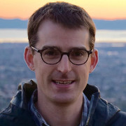
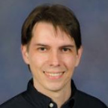
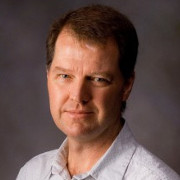

# Faculty

{::nomarkdown}

{:/nomarkdown}
{: .profile-img}
### [Dr. Cayelan Carey <i class="fa fa-link"></i>](http://www.carey.biol.vt.edu/){: .clear-both}

Assistant Professor, Carey Lab, Virginia Tech
{::nomarkdown}
{:/nomarkdown}

{::nomarkdown}
{:/nomarkdown}
{: .profile-img}
### [Dr. Michael Sorice <i class="fa fa-link"></i>](https://frec.vt.edu/People/Sorice.html){: .clear-both}

Assistant Professor, Department of Forest Resources and Environmental Conservation, Virginia Tech
{::nomarkdown}
{:/nomarkdown}

{::nomarkdown}
{:/nomarkdown}
{: .profile-img}
### [Dr. Quinn Thomas <i class="fa fa-link"></i>](http://www.globalchange.vt.edu/quinn-thomas/){: .clear-both}

Assistant Professor, Department of Forest Resources and Environmental Conservation, Virginia Tech
{::nomarkdown}

{:/nomarkdown}

{::nomarkdown}

{:/nomarkdown}
{: .profile-img}
### [Dr. Francois Birgand <i class="fa fa-link"></i>](https://www.bae.ncsu.edu/people/birgand/)

Assistant Professor, Department of Biological and Agricultural Engineering, North Carolina State University
{::nomarkdown}
{:/nomarkdown}

{::nomarkdown}
{:/nomarkdown}
{: .profile-img}
### [Dr. Renato Figueiredo <i class="fa fa-link"></i>](https://www.acis.ufl.edu/people/renatof)

Professor, ACIS Lab, University of Florida
{::nomarkdown}
{:/nomarkdown}

{::nomarkdown}
{:/nomarkdown}
{: .profile-img}
### [Dr. John Little <i class="fa fa-link"></i>](http://www.globalchange.vt.edu/john-little/)

Charles E. Via Jr. Professor of Civil and Environmental Engineering, Virginia Tech
{::nomarkdown}
{:/nomarkdown}

{::nomarkdown}
{:/nomarkdown}
{: .profile-img}
### [Dr. Madeline Schreiber <i class="fa fa-link"></i>](https://geos.vt.edu/people/faculty/Madeline-Schreiber.html)

Professor, Department of Geosciences, Virginia Tech
{::nomarkdown}

{:/nomarkdown}

{: .clear-both}

# Students

{::nomarkdown}

{:/nomarkdown}
{: .profile-img}
### [Arianna Krinos <i class="fa fa-link"></i>](hhttps://github.com/akrinos)

Undergraduate Student, Carey Lab, Virginia Tech
{::nomarkdown}
{:/nomarkdown}

{::nomarkdown}
{:/nomarkdown}
{: .profile-img}
### [Mary Lofton <i class="fa fa-link"></i>](http://www.globalchange.vt.edu/mary-lofton/)

PhD Student, Carey Lab , Virginia Tech
{::nomarkdown}
{:/nomarkdown}

{::nomarkdown}
{:/nomarkdown}
{: .profile-img}
### [Ryan McClure <i class="fa fa-link"></i>](http://www.globalchange.vt.edu/ryan-mcclure/)

PhD Student, Carey Lab , Virginia Tech
{::nomarkdown}
{:/nomarkdown}

{::nomarkdown}
{:/nomarkdown}
{: .profile-img}
### [Katie Krueger <i class="fa fa-link"></i>](http://www.carey.biol.vt.edu/?page_id=13)

Undergraduate Student, Carey Lab, Virginia Tech
{::nomarkdown}

{:/nomarkdown}

{::nomarkdown}
{:/nomarkdown}
{: .profile-img}
### [Vahid Daneshmand <i class="fa fa-link"></i>](https://www.acis.ufl.edu/people/vdaneshmand)

PhD Student, ACIS Lab, University of Florida
{::nomarkdown}

{:/nomarkdown}